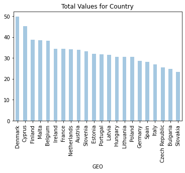

Pandas en la nube

1.	Objetivo

Introducirnos a la codificación en la nube con Jupyter y al uso de bibliotecas como Pandas para la manipulacion y consulta de datos.

2.	Material

•	Servicio de Jupyter notebook

•	Bibliotecas de Python

•	Colección de datos ‘csv’ recabados de: https://github.com/DataScienceUB/introduction-datascience-python-book/blob/master/files/ch02/educ_figdp_1_Data.csv


3.	Inicialización de la plataforma

Para poder trabajar en la nube con las libretas de Jupyter basta con ir a su sitio web https://jupyter.org/ donde tendremos la opción de probar el servicio desde el navegador, o bien existe también la opción de instalar Jupyter en nuestra computadora. En este caso instalaremos Jupyter en nuestra máquina

Para ello basta con ejecutar los siguientes comandos en consola (en este caso windows) teniendo en cuenta que deberemos tener Python ya instalado en la computadora así como las respectivas bibliotecas (pandas, numpy, matplotlib)

*Pip install jupyterlab*

*Pip install notebook*

Una vez hemos instalado Jupyter en la computadora, ejecutaremos el siguiente comando para crear una nueva libreta en la ruta dónde ejecutemos el comando

*jupyter notebook*

Una vez ejecutamos la instrucción, se nos abrirá el servidor de jupyter en el navegador con la url http://localhost:8888/tree, que es el directorio desde el cual hemos ejecutado la instrucción. Aquí podremos agregar archivos para su utilización en la libreta de jupyter desde la nube, más adelante veremos cómo.

En el navegador veremos el contenido de la carpeta en la que estamos trabajando, desde la cual podremos crear una libreta nueva para comenzar a trabajar.


4.	Importar las bibliotecas necesarias


```python
import pandas as pd
import numpy as np
import matplotlib.pyplot as plt
```

Para comprobar que funciona correctamente la importación de librerias y el funcionamiento de Python en la nube con jupyter notebook, probaremos un pequeño código haciendo uso de un “DataFrameObject”, parte de la biblioteca de Pandas.


```python
data = { 'year': [2010, 2011, 2012, 2010, 2011, 2012, 2010, 2011, 2012], 
        'team': ['FCBarcelona', 'FCBarcelona', 'FCBarcelona', 'RMadrid', 
                    'RMadrid', 'RMadrid', 'ValenciaCF', 'ValenciaCF', 'ValenciaCF'], 
                    'wins': [30, 28, 32, 29, 32, 26, 21, 17, 19], 'draws': [6, 7, 4, 5, 4, 7, 8, 10, 8], 
                    'losses': [2, 3, 2, 4, 2, 5, 9, 11, 11] }

football = pd.DataFrame(data, columns = ['year', 'team', 'wins', 'draws', 'losses'])

football
```


<div>
<style scoped>
    .dataframe tbody tr th:only-of-type {
        vertical-align: middle;
    }

    .dataframe tbody tr th {
        vertical-align: top;
    }

    .dataframe thead th {
        text-align: right;
    }
</style>
<table border="1" class="dataframe">
  <thead>
    <tr style="text-align: right;">
      <th></th>
      <th>year</th>
      <th>team</th>
      <th>wins</th>
      <th>draws</th>
      <th>losses</th>
    </tr>
  </thead>
  <tbody>
    <tr>
      <th>0</th>
      <td>2010</td>
      <td>FCBarcelona</td>
      <td>30</td>
      <td>6</td>
      <td>2</td>
    </tr>
    <tr>
      <th>1</th>
      <td>2011</td>
      <td>FCBarcelona</td>
      <td>28</td>
      <td>7</td>
      <td>3</td>
    </tr>
    <tr>
      <th>2</th>
      <td>2012</td>
      <td>FCBarcelona</td>
      <td>32</td>
      <td>4</td>
      <td>2</td>
    </tr>
    <tr>
      <th>3</th>
      <td>2010</td>
      <td>RMadrid</td>
      <td>29</td>
      <td>5</td>
      <td>4</td>
    </tr>
    <tr>
      <th>4</th>
      <td>2011</td>
      <td>RMadrid</td>
      <td>32</td>
      <td>4</td>
      <td>2</td>
    </tr>
    <tr>
      <th>5</th>
      <td>2012</td>
      <td>RMadrid</td>
      <td>26</td>
      <td>7</td>
      <td>5</td>
    </tr>
    <tr>
      <th>6</th>
      <td>2010</td>
      <td>ValenciaCF</td>
      <td>21</td>
      <td>8</td>
      <td>9</td>
    </tr>
    <tr>
      <th>7</th>
      <td>2011</td>
      <td>ValenciaCF</td>
      <td>17</td>
      <td>10</td>
      <td>11</td>
    </tr>
    <tr>
      <th>8</th>
      <td>2012</td>
      <td>ValenciaCF</td>
      <td>19</td>
      <td>8</td>
      <td>11</td>
    </tr>
  </tbody>
</table>
</div>


5.	Resultados esperados
Revisar y probar algunas funciones de la biblioteca Pandas para Python que nos ayuden a explorar una colección de datos.


6.	“Education and training data”
Para este ejercicio se hará uso de la recopilación de datos mencionados anteriormente acerca de algunos datos estadísticos de Europa. Para ello deberemos tener el archivo csv en el mismo directorio desde el que hemos creado el proyecto.

Una vez que tenemos el archivo csv en nuestro directorio podemos empezar con las pruebas:

    1.	Lectura de datos


```python
#Reading Data
edu = pd.read_csv('educ_figdp_1_Data.csv',na_values=':', usecols=['TIME', 'GEO', 'Value'])

edu
```


<div>
<style scoped>
    .dataframe tbody tr th:only-of-type {
        vertical-align: middle;
    }

    .dataframe tbody tr th {
        vertical-align: top;
    }

    .dataframe thead th {
        text-align: right;
    }
</style>
<table border="1" class="dataframe">
  <thead>
    <tr style="text-align: right;">
      <th></th>
      <th>TIME</th>
      <th>GEO</th>
      <th>Value</th>
    </tr>
  </thead>
  <tbody>
    <tr>
      <th>0</th>
      <td>2000</td>
      <td>European Union (28 countries)</td>
      <td>NaN</td>
    </tr>
    <tr>
      <th>1</th>
      <td>2001</td>
      <td>European Union (28 countries)</td>
      <td>NaN</td>
    </tr>
    <tr>
      <th>2</th>
      <td>2002</td>
      <td>European Union (28 countries)</td>
      <td>5.00</td>
    </tr>
    <tr>
      <th>3</th>
      <td>2003</td>
      <td>European Union (28 countries)</td>
      <td>5.03</td>
    </tr>
    <tr>
      <th>4</th>
      <td>2004</td>
      <td>European Union (28 countries)</td>
      <td>4.95</td>
    </tr>
    <tr>
      <th>...</th>
      <td>...</td>
      <td>...</td>
      <td>...</td>
    </tr>
    <tr>
      <th>379</th>
      <td>2007</td>
      <td>Finland</td>
      <td>5.90</td>
    </tr>
    <tr>
      <th>380</th>
      <td>2008</td>
      <td>Finland</td>
      <td>6.10</td>
    </tr>
    <tr>
      <th>381</th>
      <td>2009</td>
      <td>Finland</td>
      <td>6.81</td>
    </tr>
    <tr>
      <th>382</th>
      <td>2010</td>
      <td>Finland</td>
      <td>6.85</td>
    </tr>
    <tr>
      <th>383</th>
      <td>2011</td>
      <td>Finland</td>
      <td>6.76</td>
    </tr>
  </tbody>
</table>
<p>384 rows × 3 columns</p>
</div>


Leemos el archivo de datos csv con la función de pandas read_csv, y el frame resultante de la lectura se almacena en edu, que posteriormente imprimimos en pantalla. Como podemos ver, no se muestran todos los resultados pues son demasiados como para mostrarlos en pantalla, sin embargo, la salida nos indica que existen mas elementos, y nos muestra los primeros y los últimos datos del archivo.

Si queremos mostrar únicamente un cierto número de filas del archivo podemos usar la instrucción head() a la hora de imprimir. Por defecto nos mostrará las primeras 5 filas, aunque también podremos indicarle cuantas filas debe imprimir


```python
edu.head()
```


<div>
<style scoped>
    .dataframe tbody tr th:only-of-type {
        vertical-align: middle;
    }

    .dataframe tbody tr th {
        vertical-align: top;
    }

    .dataframe thead th {
        text-align: right;
    }
</style>
<table border="1" class="dataframe">
  <thead>
    <tr style="text-align: right;">
      <th></th>
      <th>TIME</th>
      <th>GEO</th>
      <th>Value</th>
    </tr>
  </thead>
  <tbody>
    <tr>
      <th>0</th>
      <td>2000</td>
      <td>European Union (28 countries)</td>
      <td>NaN</td>
    </tr>
    <tr>
      <th>1</th>
      <td>2001</td>
      <td>European Union (28 countries)</td>
      <td>NaN</td>
    </tr>
    <tr>
      <th>2</th>
      <td>2002</td>
      <td>European Union (28 countries)</td>
      <td>5.00</td>
    </tr>
    <tr>
      <th>3</th>
      <td>2003</td>
      <td>European Union (28 countries)</td>
      <td>5.03</td>
    </tr>
    <tr>
      <th>4</th>
      <td>2004</td>
      <td>European Union (28 countries)</td>
      <td>4.95</td>
    </tr>
  </tbody>
</table>
</div>


```python
edu.head(7)
```


<div>
<style scoped>
    .dataframe tbody tr th:only-of-type {
        vertical-align: middle;
    }

    .dataframe tbody tr th {
        vertical-align: top;
    }

    .dataframe thead th {
        text-align: right;
    }
</style>
<table border="1" class="dataframe">
  <thead>
    <tr style="text-align: right;">
      <th></th>
      <th>TIME</th>
      <th>GEO</th>
      <th>Value</th>
    </tr>
  </thead>
  <tbody>
    <tr>
      <th>0</th>
      <td>2000</td>
      <td>European Union (28 countries)</td>
      <td>NaN</td>
    </tr>
    <tr>
      <th>1</th>
      <td>2001</td>
      <td>European Union (28 countries)</td>
      <td>NaN</td>
    </tr>
    <tr>
      <th>2</th>
      <td>2002</td>
      <td>European Union (28 countries)</td>
      <td>5.00</td>
    </tr>
    <tr>
      <th>3</th>
      <td>2003</td>
      <td>European Union (28 countries)</td>
      <td>5.03</td>
    </tr>
    <tr>
      <th>4</th>
      <td>2004</td>
      <td>European Union (28 countries)</td>
      <td>4.95</td>
    </tr>
    <tr>
      <th>5</th>
      <td>2005</td>
      <td>European Union (28 countries)</td>
      <td>4.92</td>
    </tr>
    <tr>
      <th>6</th>
      <td>2006</td>
      <td>European Union (28 countries)</td>
      <td>4.91</td>
    </tr>
  </tbody>
</table>
</div>


De manera similar, tenemos la función tail(), pero que en esta ocasión nos mostrará los últimos datos del archivo csv.


```python
edu.tail(6)
```


<div>
<style scoped>
    .dataframe tbody tr th:only-of-type {
        vertical-align: middle;
    }

    .dataframe tbody tr th {
        vertical-align: top;
    }

    .dataframe thead th {
        text-align: right;
    }
</style>
<table border="1" class="dataframe">
  <thead>
    <tr style="text-align: right;">
      <th></th>
      <th>TIME</th>
      <th>GEO</th>
      <th>Value</th>
    </tr>
  </thead>
  <tbody>
    <tr>
      <th>378</th>
      <td>2006</td>
      <td>Finland</td>
      <td>6.18</td>
    </tr>
    <tr>
      <th>379</th>
      <td>2007</td>
      <td>Finland</td>
      <td>5.90</td>
    </tr>
    <tr>
      <th>380</th>
      <td>2008</td>
      <td>Finland</td>
      <td>6.10</td>
    </tr>
    <tr>
      <th>381</th>
      <td>2009</td>
      <td>Finland</td>
      <td>6.81</td>
    </tr>
    <tr>
      <th>382</th>
      <td>2010</td>
      <td>Finland</td>
      <td>6.85</td>
    </tr>
    <tr>
      <th>383</th>
      <td>2011</td>
      <td>Finland</td>
      <td>6.76</td>
    </tr>
  </tbody>
</table>
</div>


Existe también la función describe(), que nos ofrece una breve información estadística de las columnas del DataFrame que hemos creado.


```python
edu.describe()
```


<div>
<style scoped>
    .dataframe tbody tr th:only-of-type {
        vertical-align: middle;
    }

    .dataframe tbody tr th {
        vertical-align: top;
    }

    .dataframe thead th {
        text-align: right;
    }
</style>
<table border="1" class="dataframe">
  <thead>
    <tr style="text-align: right;">
      <th></th>
      <th>TIME</th>
      <th>Value</th>
    </tr>
  </thead>
  <tbody>
    <tr>
      <th>count</th>
      <td>384.000000</td>
      <td>361.000000</td>
    </tr>
    <tr>
      <th>mean</th>
      <td>2005.500000</td>
      <td>5.203989</td>
    </tr>
    <tr>
      <th>std</th>
      <td>3.456556</td>
      <td>1.021694</td>
    </tr>
    <tr>
      <th>min</th>
      <td>2000.000000</td>
      <td>2.880000</td>
    </tr>
    <tr>
      <th>25%</th>
      <td>2002.750000</td>
      <td>4.620000</td>
    </tr>
    <tr>
      <th>50%</th>
      <td>2005.500000</td>
      <td>5.060000</td>
    </tr>
    <tr>
      <th>75%</th>
      <td>2008.250000</td>
      <td>5.660000</td>
    </tr>
    <tr>
      <th>max</th>
      <td>2011.000000</td>
      <td>8.810000</td>
    </tr>
  </tbody>
</table>
</div>


    2.	Selección de datos
    
Ahora veremos cómo elegir un subconjunto de datos de nuestra colección completa, para ello usaremos paréntesis cuadrados e indicaremos el campo o valor que deseamos seleccionar de nuestro dataFrame. 

Por columna:


```python
edu['TIME']
```


    0      2000
    1      2001
    2      2002
    3      2003
    4      2004
           ... 
    379    2007
    380    2008
    381    2009
    382    2010
    383    2011
    Name: TIME, Length: 384, dtype: int64


Por rango de filas:


```python
edu[5:10]
```


<div>
<style scoped>
    .dataframe tbody tr th:only-of-type {
        vertical-align: middle;
    }

    .dataframe tbody tr th {
        vertical-align: top;
    }

    .dataframe thead th {
        text-align: right;
    }
</style>
<table border="1" class="dataframe">
  <thead>
    <tr style="text-align: right;">
      <th></th>
      <th>TIME</th>
      <th>GEO</th>
      <th>Value</th>
    </tr>
  </thead>
  <tbody>
    <tr>
      <th>5</th>
      <td>2005</td>
      <td>European Union (28 countries)</td>
      <td>4.92</td>
    </tr>
    <tr>
      <th>6</th>
      <td>2006</td>
      <td>European Union (28 countries)</td>
      <td>4.91</td>
    </tr>
    <tr>
      <th>7</th>
      <td>2007</td>
      <td>European Union (28 countries)</td>
      <td>4.92</td>
    </tr>
    <tr>
      <th>8</th>
      <td>2008</td>
      <td>European Union (28 countries)</td>
      <td>5.04</td>
    </tr>
    <tr>
      <th>9</th>
      <td>2009</td>
      <td>European Union (28 countries)</td>
      <td>5.38</td>
    </tr>
  </tbody>
</table>
</div>


En el caso anterior, se nos muestran todas las columnas de las filas indicadas, si quisiéramos seleccionar un subconjunto de columnas y filas usando las etiquetas como referencias en lugar de sus posiciones podemos usar ilocindexing de la siguiente manera:


```python
edu.iloc[15:20][['GEO','TIME']]
```


<div>
<style scoped>
    .dataframe tbody tr th:only-of-type {
        vertical-align: middle;
    }

    .dataframe tbody tr th {
        vertical-align: top;
    }

    .dataframe thead th {
        text-align: right;
    }
</style>
<table border="1" class="dataframe">
  <thead>
    <tr style="text-align: right;">
      <th></th>
      <th>GEO</th>
      <th>TIME</th>
    </tr>
  </thead>
  <tbody>
    <tr>
      <th>15</th>
      <td>European Union (27 countries)</td>
      <td>2003</td>
    </tr>
    <tr>
      <th>16</th>
      <td>European Union (27 countries)</td>
      <td>2004</td>
    </tr>
    <tr>
      <th>17</th>
      <td>European Union (27 countries)</td>
      <td>2005</td>
    </tr>
    <tr>
      <th>18</th>
      <td>European Union (27 countries)</td>
      <td>2006</td>
    </tr>
    <tr>
      <th>19</th>
      <td>European Union (27 countries)</td>
      <td>2007</td>
    </tr>
  </tbody>
</table>
</div>


    3.	Filtrar datos
    
Existen mas maneras con las cuales podemos seleccionar un subconjunto de datos de nuestro conjunto total, aplicando una indexación booleana, donde podremos filtrar datos bajo el cumplimiento de una operación booleana.
En el siguiente ejemplo se muestran los últimos 7 datos cuyo campo valor es mayor a 6


```python
edu[edu['Value'] > 6].tail(7)
```


<div>
<style scoped>
    .dataframe tbody tr th:only-of-type {
        vertical-align: middle;
    }

    .dataframe tbody tr th {
        vertical-align: top;
    }

    .dataframe thead th {
        text-align: right;
    }
</style>
<table border="1" class="dataframe">
  <thead>
    <tr style="text-align: right;">
      <th></th>
      <th>TIME</th>
      <th>GEO</th>
      <th>Value</th>
    </tr>
  </thead>
  <tbody>
    <tr>
      <th>376</th>
      <td>2004</td>
      <td>Finland</td>
      <td>6.42</td>
    </tr>
    <tr>
      <th>377</th>
      <td>2005</td>
      <td>Finland</td>
      <td>6.30</td>
    </tr>
    <tr>
      <th>378</th>
      <td>2006</td>
      <td>Finland</td>
      <td>6.18</td>
    </tr>
    <tr>
      <th>380</th>
      <td>2008</td>
      <td>Finland</td>
      <td>6.10</td>
    </tr>
    <tr>
      <th>381</th>
      <td>2009</td>
      <td>Finland</td>
      <td>6.81</td>
    </tr>
    <tr>
      <th>382</th>
      <td>2010</td>
      <td>Finland</td>
      <td>6.85</td>
    </tr>
    <tr>
      <th>383</th>
      <td>2011</td>
      <td>Finland</td>
      <td>6.76</td>
    </tr>
  </tbody>
</table>
</div>


    4.	Filtrar valores faltantes

Existe un valor reservado a los valores faltantes en Pandas, el cual es NaN, no un número en inglés, que nos ayuda a representar valores faltantes en una consulta de datos. Para poder verificar dentro de un conjunto de datos que valores faltan, usamos la función isnull(), que filtra valores faltantes dentro de las filas de los datos.
En el siguiente ejemplo podemos ver las primeras 10 filas que tengan su campo Valor vacío.


```python
edu[edu["Value"].isnull()].head(10)
```


<div>
<style scoped>
    .dataframe tbody tr th:only-of-type {
        vertical-align: middle;
    }

    .dataframe tbody tr th {
        vertical-align: top;
    }

    .dataframe thead th {
        text-align: right;
    }
</style>
<table border="1" class="dataframe">
  <thead>
    <tr style="text-align: right;">
      <th></th>
      <th>TIME</th>
      <th>GEO</th>
      <th>Value</th>
    </tr>
  </thead>
  <tbody>
    <tr>
      <th>0</th>
      <td>2000</td>
      <td>European Union (28 countries)</td>
      <td>NaN</td>
    </tr>
    <tr>
      <th>1</th>
      <td>2001</td>
      <td>European Union (28 countries)</td>
      <td>NaN</td>
    </tr>
    <tr>
      <th>36</th>
      <td>2000</td>
      <td>Euro area (18 countries)</td>
      <td>NaN</td>
    </tr>
    <tr>
      <th>37</th>
      <td>2001</td>
      <td>Euro area (18 countries)</td>
      <td>NaN</td>
    </tr>
    <tr>
      <th>48</th>
      <td>2000</td>
      <td>Euro area (17 countries)</td>
      <td>NaN</td>
    </tr>
    <tr>
      <th>49</th>
      <td>2001</td>
      <td>Euro area (17 countries)</td>
      <td>NaN</td>
    </tr>
    <tr>
      <th>60</th>
      <td>2000</td>
      <td>Euro area (15 countries)</td>
      <td>NaN</td>
    </tr>
    <tr>
      <th>72</th>
      <td>2000</td>
      <td>Euro area (13 countries)</td>
      <td>NaN</td>
    </tr>
    <tr>
      <th>84</th>
      <td>2000</td>
      <td>Belgium</td>
      <td>NaN</td>
    </tr>
    <tr>
      <th>174</th>
      <td>2006</td>
      <td>Greece</td>
      <td>NaN</td>
    </tr>
  </tbody>
</table>
</div>


    5.	Manipulación de datos
    
A continuación, veremos un ejemplo de algunas de las funciones mas populares para la manipulación de datos dentro de la biblioteca de Pandas.


```python
edu.max(axis = 0)
```


    TIME      2011
    GEO      Spain
    Value     8.81
    dtype: object


```python
print ('Pandas max function:', edu['Value'].max())
```

    Pandas max function: 8.81
    


```python
s = edu["Value"]/100
s.head()
```


    0       NaN
    1       NaN
    2    0.0500
    3    0.0503
    4    0.0495
    Name: Value, dtype: float64


```python
s = edu["Value"].apply(np.sqrt)
s.head()
```


    0         NaN
    1         NaN
    2    2.236068
    3    2.242766
    4    2.224860
    Name: Value, dtype: float64


```python
s = edu["Value"].apply(lambda d: d**2)
s.head()
```


    0        NaN
    1        NaN
    2    25.0000
    3    25.3009
    4    24.5025
    Name: Value, dtype: float64


```python
edu['ValueNorm'] = edu['Value']/edu['Value'].max()
edu.tail()
```


<div>
<style scoped>
    .dataframe tbody tr th:only-of-type {
        vertical-align: middle;
    }

    .dataframe tbody tr th {
        vertical-align: top;
    }

    .dataframe thead th {
        text-align: right;
    }
</style>
<table border="1" class="dataframe">
  <thead>
    <tr style="text-align: right;">
      <th></th>
      <th>TIME</th>
      <th>GEO</th>
      <th>Value</th>
      <th>ValueNorm</th>
    </tr>
  </thead>
  <tbody>
    <tr>
      <th>379</th>
      <td>2007</td>
      <td>Finland</td>
      <td>5.90</td>
      <td>0.669694</td>
    </tr>
    <tr>
      <th>380</th>
      <td>2008</td>
      <td>Finland</td>
      <td>6.10</td>
      <td>0.692395</td>
    </tr>
    <tr>
      <th>381</th>
      <td>2009</td>
      <td>Finland</td>
      <td>6.81</td>
      <td>0.772985</td>
    </tr>
    <tr>
      <th>382</th>
      <td>2010</td>
      <td>Finland</td>
      <td>6.85</td>
      <td>0.777526</td>
    </tr>
    <tr>
      <th>383</th>
      <td>2011</td>
      <td>Finland</td>
      <td>6.76</td>
      <td>0.767310</td>
    </tr>
  </tbody>
</table>
</div>


```python
edu.drop('ValueNorm', axis = 1, inplace = True)
edu.head()
```


<div>
<style scoped>
    .dataframe tbody tr th:only-of-type {
        vertical-align: middle;
    }

    .dataframe tbody tr th {
        vertical-align: top;
    }

    .dataframe thead th {
        text-align: right;
    }
</style>
<table border="1" class="dataframe">
  <thead>
    <tr style="text-align: right;">
      <th></th>
      <th>TIME</th>
      <th>GEO</th>
      <th>Value</th>
    </tr>
  </thead>
  <tbody>
    <tr>
      <th>0</th>
      <td>2000</td>
      <td>European Union (28 countries)</td>
      <td>NaN</td>
    </tr>
    <tr>
      <th>1</th>
      <td>2001</td>
      <td>European Union (28 countries)</td>
      <td>NaN</td>
    </tr>
    <tr>
      <th>2</th>
      <td>2002</td>
      <td>European Union (28 countries)</td>
      <td>5.00</td>
    </tr>
    <tr>
      <th>3</th>
      <td>2003</td>
      <td>European Union (28 countries)</td>
      <td>5.03</td>
    </tr>
    <tr>
      <th>4</th>
      <td>2004</td>
      <td>European Union (28 countries)</td>
      <td>4.95</td>
    </tr>
  </tbody>
</table>
</div>


```python
edu = edu.append({"TIME": 2000, "Value": 5.00, "GEO": 'a'},ignore_index = True)
edu.tail()
```


<div>
<style scoped>
    .dataframe tbody tr th:only-of-type {
        vertical-align: middle;
    }

    .dataframe tbody tr th {
        vertical-align: top;
    }

    .dataframe thead th {
        text-align: right;
    }
</style>
<table border="1" class="dataframe">
  <thead>
    <tr style="text-align: right;">
      <th></th>
      <th>TIME</th>
      <th>GEO</th>
      <th>Value</th>
    </tr>
  </thead>
  <tbody>
    <tr>
      <th>380</th>
      <td>2008</td>
      <td>Finland</td>
      <td>6.10</td>
    </tr>
    <tr>
      <th>381</th>
      <td>2009</td>
      <td>Finland</td>
      <td>6.81</td>
    </tr>
    <tr>
      <th>382</th>
      <td>2010</td>
      <td>Finland</td>
      <td>6.85</td>
    </tr>
    <tr>
      <th>383</th>
      <td>2011</td>
      <td>Finland</td>
      <td>6.76</td>
    </tr>
    <tr>
      <th>384</th>
      <td>2000</td>
      <td>a</td>
      <td>5.00</td>
    </tr>
  </tbody>
</table>
</div>


```python
edu.drop(max(edu.index), axis = 0, inplace = True)
edu.tail()
```


<div>
<style scoped>
    .dataframe tbody tr th:only-of-type {
        vertical-align: middle;
    }

    .dataframe tbody tr th {
        vertical-align: top;
    }

    .dataframe thead th {
        text-align: right;
    }
</style>
<table border="1" class="dataframe">
  <thead>
    <tr style="text-align: right;">
      <th></th>
      <th>TIME</th>
      <th>GEO</th>
      <th>Value</th>
    </tr>
  </thead>
  <tbody>
    <tr>
      <th>379</th>
      <td>2007</td>
      <td>Finland</td>
      <td>5.90</td>
    </tr>
    <tr>
      <th>380</th>
      <td>2008</td>
      <td>Finland</td>
      <td>6.10</td>
    </tr>
    <tr>
      <th>381</th>
      <td>2009</td>
      <td>Finland</td>
      <td>6.81</td>
    </tr>
    <tr>
      <th>382</th>
      <td>2010</td>
      <td>Finland</td>
      <td>6.85</td>
    </tr>
    <tr>
      <th>383</th>
      <td>2011</td>
      <td>Finland</td>
      <td>6.76</td>
    </tr>
  </tbody>
</table>
</div>


```python
eduDrop = edu[~edu["Value"].isnull()].copy()
eduDrop.head()
```


<div>
<style scoped>
    .dataframe tbody tr th:only-of-type {
        vertical-align: middle;
    }

    .dataframe tbody tr th {
        vertical-align: top;
    }

    .dataframe thead th {
        text-align: right;
    }
</style>
<table border="1" class="dataframe">
  <thead>
    <tr style="text-align: right;">
      <th></th>
      <th>TIME</th>
      <th>GEO</th>
      <th>Value</th>
    </tr>
  </thead>
  <tbody>
    <tr>
      <th>2</th>
      <td>2002</td>
      <td>European Union (28 countries)</td>
      <td>5.00</td>
    </tr>
    <tr>
      <th>3</th>
      <td>2003</td>
      <td>European Union (28 countries)</td>
      <td>5.03</td>
    </tr>
    <tr>
      <th>4</th>
      <td>2004</td>
      <td>European Union (28 countries)</td>
      <td>4.95</td>
    </tr>
    <tr>
      <th>5</th>
      <td>2005</td>
      <td>European Union (28 countries)</td>
      <td>4.92</td>
    </tr>
    <tr>
      <th>6</th>
      <td>2006</td>
      <td>European Union (28 countries)</td>
      <td>4.91</td>
    </tr>
  </tbody>
</table>
</div>


```python
eduDrop = edu.dropna(how = 'any', subset = ["Value"])
eduDrop.head()
```


<div>
<style scoped>
    .dataframe tbody tr th:only-of-type {
        vertical-align: middle;
    }

    .dataframe tbody tr th {
        vertical-align: top;
    }

    .dataframe thead th {
        text-align: right;
    }
</style>
<table border="1" class="dataframe">
  <thead>
    <tr style="text-align: right;">
      <th></th>
      <th>TIME</th>
      <th>GEO</th>
      <th>Value</th>
    </tr>
  </thead>
  <tbody>
    <tr>
      <th>2</th>
      <td>2002</td>
      <td>European Union (28 countries)</td>
      <td>5.00</td>
    </tr>
    <tr>
      <th>3</th>
      <td>2003</td>
      <td>European Union (28 countries)</td>
      <td>5.03</td>
    </tr>
    <tr>
      <th>4</th>
      <td>2004</td>
      <td>European Union (28 countries)</td>
      <td>4.95</td>
    </tr>
    <tr>
      <th>5</th>
      <td>2005</td>
      <td>European Union (28 countries)</td>
      <td>4.92</td>
    </tr>
    <tr>
      <th>6</th>
      <td>2006</td>
      <td>European Union (28 countries)</td>
      <td>4.91</td>
    </tr>
  </tbody>
</table>
</div>


```python
eduFilled = edu.fillna(value = {"Value": 0})
eduFilled.head()
```


<div>
<style scoped>
    .dataframe tbody tr th:only-of-type {
        vertical-align: middle;
    }

    .dataframe tbody tr th {
        vertical-align: top;
    }

    .dataframe thead th {
        text-align: right;
    }
</style>
<table border="1" class="dataframe">
  <thead>
    <tr style="text-align: right;">
      <th></th>
      <th>TIME</th>
      <th>GEO</th>
      <th>Value</th>
    </tr>
  </thead>
  <tbody>
    <tr>
      <th>0</th>
      <td>2000</td>
      <td>European Union (28 countries)</td>
      <td>0.00</td>
    </tr>
    <tr>
      <th>1</th>
      <td>2001</td>
      <td>European Union (28 countries)</td>
      <td>0.00</td>
    </tr>
    <tr>
      <th>2</th>
      <td>2002</td>
      <td>European Union (28 countries)</td>
      <td>5.00</td>
    </tr>
    <tr>
      <th>3</th>
      <td>2003</td>
      <td>European Union (28 countries)</td>
      <td>5.03</td>
    </tr>
    <tr>
      <th>4</th>
      <td>2004</td>
      <td>European Union (28 countries)</td>
      <td>4.95</td>
    </tr>
  </tbody>
</table>
</div>


    6.	Ordenamiento de datos

Otra función importante a tener en cuenta es como ordenar los datos que hemos consultado de nuestro conjunto de datos, podemos, por ejemplo, usar la función de sort de la biblioteca Pandas. En el siguiente ejemplo haremos la impresión de las 5 primeras filas, ordenadas por valor de mayor a menor.


```python
edu.sort_values(by = 'Value', ascending = False, inplace = True)
edu.head()
```


<div>
<style scoped>
    .dataframe tbody tr th:only-of-type {
        vertical-align: middle;
    }

    .dataframe tbody tr th {
        vertical-align: top;
    }

    .dataframe thead th {
        text-align: right;
    }
</style>
<table border="1" class="dataframe">
  <thead>
    <tr style="text-align: right;">
      <th></th>
      <th>TIME</th>
      <th>GEO</th>
      <th>Value</th>
    </tr>
  </thead>
  <tbody>
    <tr>
      <th>130</th>
      <td>2010</td>
      <td>Denmark</td>
      <td>8.81</td>
    </tr>
    <tr>
      <th>131</th>
      <td>2011</td>
      <td>Denmark</td>
      <td>8.75</td>
    </tr>
    <tr>
      <th>129</th>
      <td>2009</td>
      <td>Denmark</td>
      <td>8.74</td>
    </tr>
    <tr>
      <th>121</th>
      <td>2001</td>
      <td>Denmark</td>
      <td>8.44</td>
    </tr>
    <tr>
      <th>122</th>
      <td>2002</td>
      <td>Denmark</td>
      <td>8.44</td>
    </tr>
  </tbody>
</table>
</div>


    7.	Agrupamiento de datos

Otra función util para inspeccionar datos es agruparlos de a acuerdo a algún criterio, por ejemplo, para la colección de datos que tenemos, sería bueno agruparlos por país. En el siguiente ejemplo mostraremos los datos agrupados por país del promedio del campo valor en cada uno de ellos. Para ello haremos lo siguiente:


```python
group = edu[["GEO", "Value"]].groupby('GEO').mean()
group.head()
```


<div>
<style scoped>
    .dataframe tbody tr th:only-of-type {
        vertical-align: middle;
    }

    .dataframe tbody tr th {
        vertical-align: top;
    }

    .dataframe thead th {
        text-align: right;
    }
</style>
<table border="1" class="dataframe">
  <thead>
    <tr style="text-align: right;">
      <th></th>
      <th>Value</th>
    </tr>
    <tr>
      <th>GEO</th>
      <th></th>
    </tr>
  </thead>
  <tbody>
    <tr>
      <th>Austria</th>
      <td>5.618333</td>
    </tr>
    <tr>
      <th>Belgium</th>
      <td>6.189091</td>
    </tr>
    <tr>
      <th>Bulgaria</th>
      <td>4.093333</td>
    </tr>
    <tr>
      <th>Cyprus</th>
      <td>7.023333</td>
    </tr>
    <tr>
      <th>Czech Republic</th>
      <td>4.168333</td>
    </tr>
  </tbody>
</table>
</div>


    8.	Reordenamiento de datos

En el siguiente ejemplo, transformaremos nuestro DataFrame a una estructura donde el nombre de cada país funja como índice y las columnas sean los años, mostrando en cada casilla el campo valor


```python
filtered_data = edu[edu["TIME"] > 2005]
pivedu = pd.pivot_table(filtered_data, values = 'Value',
 index = ['GEO'], columns = ['TIME'])
pivedu.head()
```


<div>
<style scoped>
    .dataframe tbody tr th:only-of-type {
        vertical-align: middle;
    }

    .dataframe tbody tr th {
        vertical-align: top;
    }

    .dataframe thead th {
        text-align: right;
    }
</style>
<table border="1" class="dataframe">
  <thead>
    <tr style="text-align: right;">
      <th>TIME</th>
      <th>2006</th>
      <th>2007</th>
      <th>2008</th>
      <th>2009</th>
      <th>2010</th>
      <th>2011</th>
    </tr>
    <tr>
      <th>GEO</th>
      <th></th>
      <th></th>
      <th></th>
      <th></th>
      <th></th>
      <th></th>
    </tr>
  </thead>
  <tbody>
    <tr>
      <th>Austria</th>
      <td>5.40</td>
      <td>5.33</td>
      <td>5.47</td>
      <td>5.98</td>
      <td>5.91</td>
      <td>5.80</td>
    </tr>
    <tr>
      <th>Belgium</th>
      <td>5.98</td>
      <td>6.00</td>
      <td>6.43</td>
      <td>6.57</td>
      <td>6.58</td>
      <td>6.55</td>
    </tr>
    <tr>
      <th>Bulgaria</th>
      <td>4.04</td>
      <td>3.88</td>
      <td>4.44</td>
      <td>4.58</td>
      <td>4.10</td>
      <td>3.82</td>
    </tr>
    <tr>
      <th>Cyprus</th>
      <td>7.02</td>
      <td>6.95</td>
      <td>7.45</td>
      <td>7.98</td>
      <td>7.92</td>
      <td>7.87</td>
    </tr>
    <tr>
      <th>Czech Republic</th>
      <td>4.42</td>
      <td>4.05</td>
      <td>3.92</td>
      <td>4.36</td>
      <td>4.25</td>
      <td>4.51</td>
    </tr>
  </tbody>
</table>
</div>


Podemos usar el nuvo indice para seleccionar nuevamente algunas filas en específico


```python
pivedu.loc[['Spain','Portugal'], [2006,2011]]
```


<div>
<style scoped>
    .dataframe tbody tr th:only-of-type {
        vertical-align: middle;
    }

    .dataframe tbody tr th {
        vertical-align: top;
    }

    .dataframe thead th {
        text-align: right;
    }
</style>
<table border="1" class="dataframe">
  <thead>
    <tr style="text-align: right;">
      <th>TIME</th>
      <th>2006</th>
      <th>2011</th>
    </tr>
    <tr>
      <th>GEO</th>
      <th></th>
      <th></th>
    </tr>
  </thead>
  <tbody>
    <tr>
      <th>Spain</th>
      <td>4.26</td>
      <td>4.82</td>
    </tr>
    <tr>
      <th>Portugal</th>
      <td>5.07</td>
      <td>5.27</td>
    </tr>
  </tbody>
</table>
</div>


    9. Clasificación de datos


```python
pivedu = pivedu.drop(['Euro area (13 countries)',
 'Euro area (15 countries)',
 'Euro area (17 countries)',
 'Euro area (18 countries)',
 'European Union (25 countries)',
 'European Union (27 countries)',
 'European Union (28 countries)'
 ], axis=0)
pivedu = pivedu.rename(
 index={'Germany (until 1990 former territory of the FRG)': 'Germany'})
pivedu = pivedu.dropna()
pivedu.rank(ascending=False, method='first').head()

```


<div>
<style scoped>
    .dataframe tbody tr th:only-of-type {
        vertical-align: middle;
    }

    .dataframe tbody tr th {
        vertical-align: top;
    }

    .dataframe thead th {
        text-align: right;
    }
</style>
<table border="1" class="dataframe">
  <thead>
    <tr style="text-align: right;">
      <th>TIME</th>
      <th>2006</th>
      <th>2007</th>
      <th>2008</th>
      <th>2009</th>
      <th>2010</th>
      <th>2011</th>
    </tr>
    <tr>
      <th>GEO</th>
      <th></th>
      <th></th>
      <th></th>
      <th></th>
      <th></th>
      <th></th>
    </tr>
  </thead>
  <tbody>
    <tr>
      <th>Austria</th>
      <td>10.0</td>
      <td>7.0</td>
      <td>11.0</td>
      <td>7.0</td>
      <td>8.0</td>
      <td>8.0</td>
    </tr>
    <tr>
      <th>Belgium</th>
      <td>5.0</td>
      <td>4.0</td>
      <td>3.0</td>
      <td>4.0</td>
      <td>5.0</td>
      <td>5.0</td>
    </tr>
    <tr>
      <th>Bulgaria</th>
      <td>21.0</td>
      <td>21.0</td>
      <td>20.0</td>
      <td>20.0</td>
      <td>22.0</td>
      <td>22.0</td>
    </tr>
    <tr>
      <th>Cyprus</th>
      <td>2.0</td>
      <td>2.0</td>
      <td>2.0</td>
      <td>2.0</td>
      <td>2.0</td>
      <td>3.0</td>
    </tr>
    <tr>
      <th>Czech Republic</th>
      <td>19.0</td>
      <td>20.0</td>
      <td>21.0</td>
      <td>21.0</td>
      <td>20.0</td>
      <td>19.0</td>
    </tr>
  </tbody>
</table>
</div>


7. Graficación de datos

Finalmente, veremos las herramientas de Pandas para la graficación de datos, en el ejemlpo siguiente se observa la creación de una gráfica del valor acumulado (suma del campo valor) de cada país en los últimos años


```python
totalSum = pivedu.sum(axis = 1).sort_values(ascending = False)
totalSum.plot(kind = 'bar', style = 'b', alpha = 0.4,
 title = "Total Values for Country")

```


    <matplotlib.axes._subplots.AxesSubplot at 0x1fdb0014d60>





También es posible definir algunos parámetros de estilo a nuestras gráficas, en el último ejemplo usaremos colores asignados por nosotros para diferenciar entre los datos, además de crear una gráfica donde utilicemos los valores de cada fila, dandonos como resultado una gráfica donde se muestre el valor acumuladro de cada país a través de los años


```python
my_colors = ['b', 'r', 'g', 'y', 'm', 'c']
ax = pivedu.plot(kind='barh', stacked=True, color=my_colors, figsize=(12, 6))
ax.legend(loc='center left', bbox_to_anchor=(1, 0.5))
plt.savefig('Value_Time_Country.png', dpi=300, bbox_inches='tight')

```


Luego de esta práctica, podemos observar el gran potencial que implica saber trabajar con Pandas, siendo una biblioteca muy útil para la gestión de nuestros datos, y siendo en conjunto con el trabajao en la nube que nos ofrece mucho mas potencial de procesamiento que una máquina convencional, saber trabajar con estas utilidades en conjunto es una herramienta muy poderosa que nos puede ayudar a resolver muchos problemas en cuanto a la gestión de datos


```python

```
